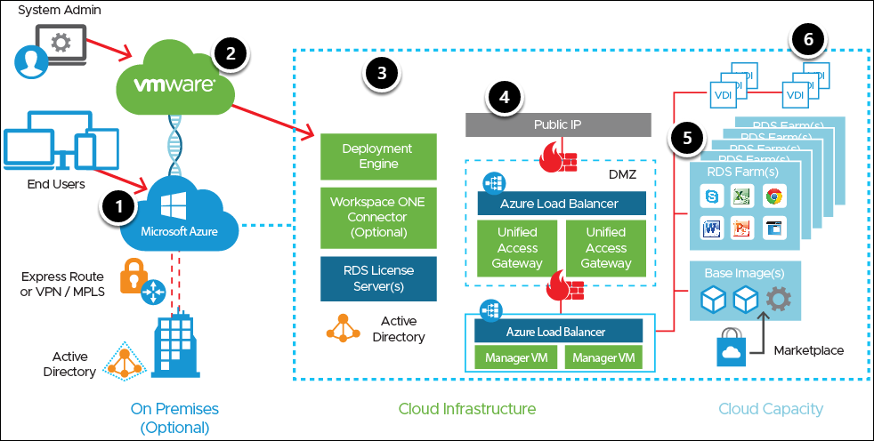

# Components and Architecture

## About System Architecture and Components

The Horizon Cloud Service on Microsoft Azure system architecture includes the standard Horizon Cloud Service components, as well as unique components and integrations that provide additional capabilities.

   
   
   **Figure 1:** Basic Horizon Cloud Service on Microsoft Azure System Architecture
   
Figure 1 demonstrates the automated provisioning of a Horizon Cloud Service pod on your Microsoft Azure capacity. **Note:** Deployments into Microsoft Azure were previously referred to as nodes. (For a more detailed diagram, see [VMware Horizon Cloud Service on Microsoft Azure Requirements Checklist For New Pod Deployments - Updated As Appropriate for Pods That Deploy Starting From the May 2021 Service Release Date](https://docs.vmware.com/en/VMware-Horizon-Cloud-Service/services/hzncloudmsazure.getstarted15/GUID-5F69086E-E061-48F3-93D9-9705B8B5FD8A.html), under **Reference Architecture**.)

1. Your Microsoft Azure infrastructure-as-a-service (IaaS) provides capacity.

2. Your VMware Horizon Cloud Service control plane is granted permission to create and manage resources with the use of a service principal in Microsoft Azure.

3. You provide additional prerequisites such as Active Directory, as well as optional components such as Deployment Engine (Jumpbox), Workspace ONE Connector, and RDS license, from either Microsoft Azure or Horizon Cloud on premises.

4. The Horizon Cloud Service control plane initiates the deployment of the Horizon Cloud Service pod, VMware Unified Access Gateway™ appliances for secure remote access, and other infrastructure components that assist with the configuration and management of the Horizon Cloud Service infrastructure.

5. After the Horizon Cloud Service pod is deployed, you can connect the pod to your own corporate AD infrastructure or create a new AD configuration in your Microsoft Azure subscription. You deploy VMs from the Microsoft Azure marketplace, which are sealed into images, and can be used in RD Session Host farms.

6. With the VDI functionality, you can also create Windows 10 assignments of both dedicated and floating desktops.

## **VMware Horizon Cloud Service Components**

Horizon Cloud Service consists of the following major components:

  - **Infrastructure:** You can choose Microsoft Azure infrastructure, VMware cloud-hosted infrastructure, or your own hyper-converged infrastructure (HCI). This guide focuses on the Microsoft Azure infrastructure option.
  - **Active Directory:** You can choose to deploy AD on premises or in cloud.
  - **Image:** Also called image template, a desktop or RDSH server image that can be used in a Horizon Cloud Service tenant to create desktop or application assignments. It is used as the base image from which virtual machines (VMs) are cloned.
  - **VMware Horizon Client™:** Software-based client installed on a desktop, thin client, mobile device, or tablet that facilitates connectivity to Horizon Cloud-hosted desktops and applications.
  - **Horizon Cloud Service tenant appliance:** A hardened Linux appliance that provides desktop and application brokering, provisioning, and entitlement services. It hosts the end-user and administrative portals.
  - **Desktop and services subnets:** Unique IP subnets that you assign to allow for desktop, application, and administrative connectivity. The Desktop Zone uses the desktop subnet for virtual desktops and RDSH servers. The Services Zone uses the services subnet for tenant appliances and other utility services.
  - **Horizon Cloud Service Control Plane:** The central location to conduct all administrative functions and policy management. From the cloud-based control plane, you can manage your RDS farms and assign applications to users and groups from any browser on any machine with an Internet connection. The cloud control plane provides access to manage all Horizon Cloud Service pods deployed into your Microsoft Azure infrastructure in a single, centralized user interface, no matter which regional data center you use.
Horizon Cloud Service Administration Console: The web-based portal, a component of the control plane, that you use to provision and manage Horizon Cloud Service desktops and applications, resource entitlements, and images. The Horizon Cloud Service Administration Console provides full life-cycle management of desktops, and Remote Desktop Session Host (RDSH) through a single, easy-to-use web-based console. Organizations can securely provision and manage desktop models and entitlements, as well as native and remote applications, through the centralized Horizon Cloud Service Administration Console. The Horizon Cloud Service Administration Console also provides usage and activity reports for various user, administrative, and capacity-management activities.
  - **VMware Unified Access Gateway:** A hardened Linux appliance that allows for secure remote access into the Horizon Cloud Service environment and is part of the Security Zone (for external Horizon Cloud Service access) and the Services Zone (for internal Horizon Cloud Service access).
  - **Optional VMware Dynamic Environment Manager (formerly known as User Environment Manager):** A scalable management solution that provides personalization of Windows and apps; dynamic policy configuration across virtual, physical, and cloud-based Windows desktop environments, for managing a user’s persona across devices and locations; and [privilege elevation](https://www.youtube.com/watch?v=YlMbz13dQpE&index=25&list=PLfr3uvmY7hBwGeHiVIfo7rGA7rk4yemEV) to aid in your privilege management strategy. VMware Dynamic Environment Manager seamlessly integrates with Horizon Cloud Service, and provides a consistent user experience across physical, virtual, and cloud-hosted PCs and RD Session Host servers. If you are already using VMware Dynamic Environment Manager on physical or virtual desktops or RD Session Host servers, your knowledge transfers immediately to Horizon Cloud Service on Microsoft Azure. For more information, see [VMware Dynamic Environment Manager](https://techzone.vmware.com/quick-start-tutorial-vmware-horizon-cloud-service-microsoft-azure).
  - **Optional VMware Workspace ONE:** You can choose to deploy a Workspace ONE connector in your data center.
  - **Optional True SSO Enrollment server:** You can choose to deploy a True SSO Enrollment server in your data center.
  - **NEW! VMware Types & Sizes:** A new feature to configure a subset of virtual machines (VMs) available for images. Microsoft Azure provides a variety of types of virtual machines (VM) and classifies them based on the memory, storage, and compute types. The length of the list of VMs makes it somewhat unwieldy, so this new feature enables you to select a subset to display to your end users as a pop-up list. During deployment, you can configure the list to include a sub-set of all available types and sizes, and you can change it any time after deployment. For more information, see [Sizes for Azure Virtual Machines in Azure](https://docs.microsoft.com/en-us/azure/virtual-machines/sizes).

## **Horizon Cloud Service on Microsoft Azure Components**

Horizon Cloud Service on Microsoft Azure deploys three appliances from your Microsoft Azure configuration that provide the following capabilities:

  - **Horizon Cloud Service Pod:** Manages all infrastructure resources. While all policy definition and management happen in the cloud, all of the real work––creating resources on Microsoft Azure infrastructure and making it available to users––happens in the Horizon Cloud Service pod.
  - **Unified Access Gateway Appliances:** Provide secure Internet access to published applications and published desktops. Two appliances, either external or internal, need to be running to share the load and connections and maintain operational SLA of the pod.
  - **Deployment Engine (Jumpbox):** A temporary Linux-based VM used during environment buildout, as well as for subsequent environment updates and upgrades.

Click on the **Next** button from lower right corner of the guide to move on the next page.
