# Exercise 1: Deploying a Horizon Cloud Service Pod

**About Pod Deployment**
Now that you have set up the Horizon Cloud Service on Microsoft Azure pod, you are ready to begin the initial configuration process of your deployment. In this series of exercises, you deploy a Horizon Cloud Service pod and bind it to an existing Active Directory domain. This grants the Horizon Cloud Service control plane access to create and manage resources in Microsoft Azure. These exercises are sequential and build upon one another, so make sure to complete each exercise in this section before going to the next.


## **Exercise 1.1: Deploying the Horizon Cloud Service Pod**

Armed with the prerequisite information from your Microsoft Azure tenant, you are now ready to begin deploying the Horizon Cloud Service pod and binding it to an existing Active Directory domain.

1. Use your My VMware credentials, which give you access to the Horizon Cloud Service control plane.

2. Before you deploy the Horizon Cloud Service pod, verify that you have the prerequisite information from your Microsoft Azure tenant, which the Horizon Cloud Service deployment wizard uses during the deployment process:

   - **Service Principal:** Like a certificate, the service principal object defines the policy and permissions for use of an application in a specific tenant, and is used to grant Horizon Cloud Service permission to access and modify your Microsoft Azure tenant

   - **Subscription ID:** Primary Microsoft Azure billing identifier based on your agreement with Microsoft

   - **Directory ID:** Your Primary Identifier or Identifiers in Microsoft Azure Active Directory
   
   - **Application ID:** An attribute of the Service Principal that securely ties the Horizon Cloud Service control plane to your Microsoft Azure subscription and is used to authorize Horizon Cloud as an application to use your Microsoft Azure capacity

   - **Application Key:** A one-time-use password that is used to encrypt the service principal. 

For more information, see _Getting Started with VMware Horizon Cloud Service on Microsoft Azure_(```https://docs.vmware.com/en/VMware-Horizon-Cloud-Service/services/hzncloudmsazure.getstarted15/GUID-6E460805-C323-4200-9A45-45E7BFB31730.html```).

### **Task 1: Log in to VMware Horizon Cloud Service**

   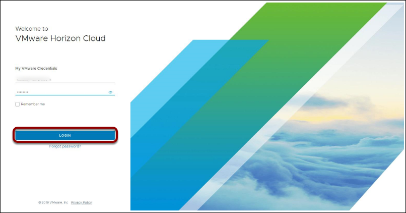

  - Open ```https://cloud.horizon.vmware.com/login2/login``` in a browser.
  
   
   
  - In the lab guide, navigate to **Environment Details tab > VMWare Horizon Account Details**. Under _Actions_ tab, click on copy button to copy the credentials.

   

  -  Return to Login page and paste the VMware account ID and password under _My VMWare Credentials_ and click on **Login**.

**Note:** Select **Accept** for _Terms of Service_ popup.

   

### **Task 2: Add a New Horizon Cloud Service Pod**

   

  - In an account with no pods previously deployed, the Getting Started wizard defaults to the Capacity section. 

   - In the upper right corner of **Microsoft Azure** pane, click on **Manage** and the select **Add**. Adding capacity is equivalent to deploying a pod in a capacity environment and connecting that pod to your overall Horizon Cloud environment.

**Note:** To add a new Microsoft Azure pod to an account with pods previously deployed, you can alternatively click **Settings > Capacity > New > Pod > Microsoft Azure**.


### **Task 3: Provide Subscription Details**

   

1. In the Add Microsoft Azure Capacity tab, to fill the data navigate to **Environment Details tab >  Service Principal Details:

   

   - **Apply Subscription:** Select **Add New** and enter the new subscription information.
    
   - **Subscription Name:** Enter a recognizable name to distinguish this subscription from others. The name must start with a letter and contain only letters, numbers, and dashes.
   
   - **Environment:** Select the environment associated with your Microsoft Azure subscription.
    
   - **Subscription ID:** Enter the subscription ID in UUID form, from the Subscription area of your Microsoft Azure portal.
    
   - **Directory ID:** Enter the Microsoft Azure AD Directory ID in UUID form, from the Microsoft Azure Active Directory properties in your Microsoft Azure portal.
    
   - **Application ID:** Enter the application ID in UUID form associated with the service principal you created in the Microsoft Azure portal. Creating an application registration and associated service principal in your Microsoft Azure Active Directory was a prerequisite. The application registration is used to authorize Horizon Cloud as an application to use your Microsoft Azure capacity.
    
   - **Application Key:** Enter the key value for the client secret of the service principal that you created in the Microsoft Azure portal. Creating this client secret was a prerequisite.
   
   - **Use a Different Subscription for External Gateway:** Accept the default and leave this option disabled.

2. In the lower right corner, click **Next**.

### **Task 4: Provide Pod Setup Details**

   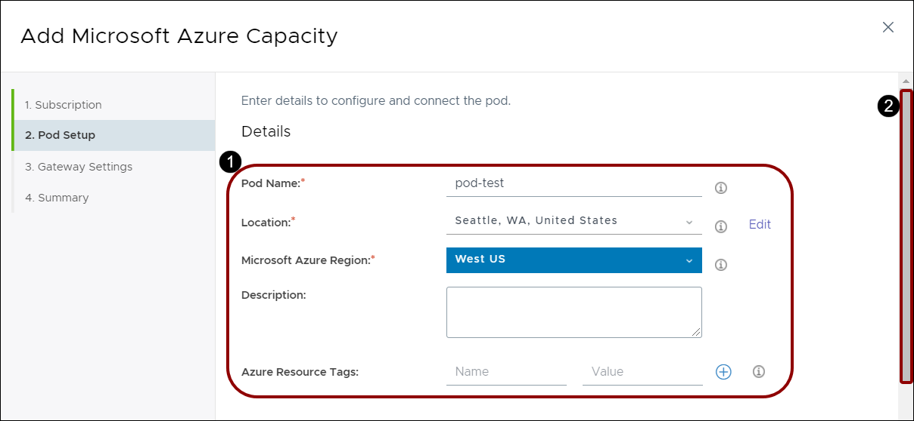

1. In the Details panel of the Pod Setup tab, provide the following information:
   
   - **Pod Name:** Enter a recognizable name, to be used in the Administration Console to distinguish this pod from other pods.
    
   - **Location:** Click **Add** to specify a location, which you can use to group pods according to categories that you provide, such as Business Unit A, Business Unit B, and so on. As you enter a city name, it should auto-populate. If your city name is not recognized, it will not be placed correctly on the Dashboard map. In this case, select the closest city available.
    
   - **Microsoft Azure Region:** Select the physical geographic Microsoft Azure region into which you want the pod to be deployed. For best performance, deploy the Horizon Cloud Service pod in a region that is geographically near the end users consuming the service to provide lower latency.

   - **Description:** Enter an optional description for this pod.

2. Scroll down to the next panel.


### **Task 5: Provide Networking Details**

   

1. In the Networking panel of the Work Setup tab, provide the following information:
    
   - **Virtual Network:** Select a virtual network from the list. Only virtual networks that exist in the region selected in the Microsoft Azure Region field are shown here. 
    
   - **Use Existing Subnet:** Slide to enable, as in this example.
    
   - **Management Subnet:** Enter a subnet (in CIDR notation) to which the pod and Unified Access Gateway instances get connected, such as 192.168.8.0/28. For the management subnet, a CIDR of at least /28 is required.
    
   - **Desktop Subnet:** Enter the subnet (in CIDR notation) to which all of this pod's RDSH servers for end-user remote desktops and applications get connected, such as 192.168.12.0/22. Minimum: /28. Recommended: /22.
    
   - **NTP Servers:** Enter the list of NTP servers to use for time synchronization, separated by commas (for example 10.11.12.13, time.example.com).
    
   - **Use Proxy:** Slide to enable, or leave disabled as in this example.

2. In the Identity Management panel, accept the default, and click **Next**.

### **Task 6: Provide Unified Access Gateway Details**

   

1. In the Unified Access Gateway panel of the Work Setup tab, provide the following information.
    
   - **Enable External UAG?** Slide to enable, as in this example.
    
   - **Internet Enabled Desktops:** Select Yes to enable users located outside your corporate network to access desktops and applications. The pod includes a load balancer and Unified Access Gateway instances to enable this access. Selecting Internet-enabled desktops triggers Horizon Cloud Service to automatically deploy two Unified Access Gateway appliances in an availability setting.
    
   - **FQDN:** Enter the required fully qualified domain name (FQDN), such as ourOrg.example.com, for your end users to use to access the service. You must own that domain name and have a certificate in PEM format that can validate that FQDN.
    
   - **DMZ Subnet:** Enter the subnet in CIDR notation for the demilitarized zone (DMZ) network to be configured to connect the Unified Access Gateway instances to the load balancer.
    
   - **DMZ Addresses:** Accept default.
    
   - **Route:** Leave blank.
    
   - **Certificate:** Upload the certificate in PEM format for Unified Access Gateway to use to allow clients to trust connections to the Unified Access Gateway instances running in Microsoft Azure. The certificate must be based on the FQDN you entered and be signed by a trusted CA. A certificate is automatically applied to the two Unified Access Gateway appliances during deployment.
    
   - **Use a Different Virtual Network:** Accept the default and leave this option disabled.

2. For this exercise, leave the two-factor identification settings disabled, and in the lower right corner, click **Validate & Proceed**.


### **Task 7: Review Summary**

   

  - Review the summary, verify that the information is correct and complete, and then click **Submit**.

**Note: This process will take 60 minutes to complete.**

### **Task 8: Verify That the Pod Is Deployed**

   

  - Wait until the green check mark appears, which indicates that the Horizon Cloud Service pod and all supporting infrastructure components are deployed.

After you finish deploying the Horizon Cloud Service pod, proceed to the next exercise to perform the domain bind operation.


## **Exercise 1.2: Binding to the Active Directory Domain**

Machine creation and domain join operations are automated by Horizon Cloud Service. The domain bind operation must be performed on the pod before creating images and farms. You have several Active Directory domain configurations to choose from. For more information about these options, see _Getting Started with VMware Horizon Cloud Service on Microsoft Azure_(```https://docs.vmware.com/en/VMware-Horizon-Cloud-Service/index.html```).


### **Task 1: Get Started**

   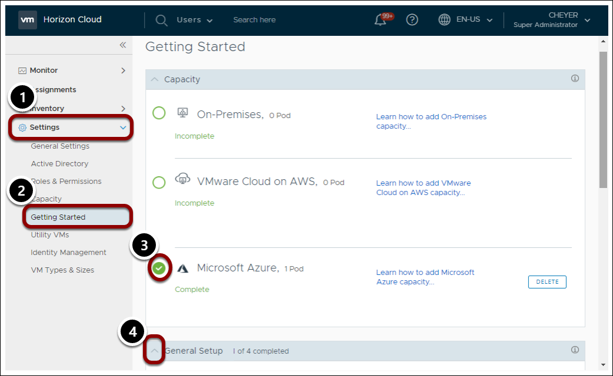

To complete the Active Directory configuration, provide information about the domain and accounts used for domain operations.

1. In the Horizon Cloud Service Administration Console, in the navigation pane on the left, click **Settings**.

2. Click **Getting Started**.

3. In the Getting Started wizard, locate the **Microsoft Azure 1 Pod** added.

4. Click **General Setup** to expand the fields.


### **Task 2: Configure Active Directory**

   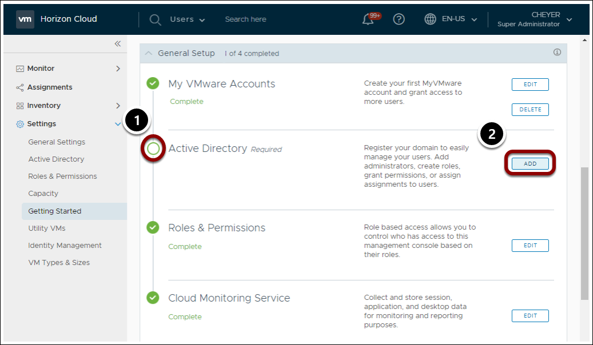

1. Under General Setup, locate the Active Directory panel.

2. On the far right, click **Add**.


### **Task 3: Register Active Directory**

   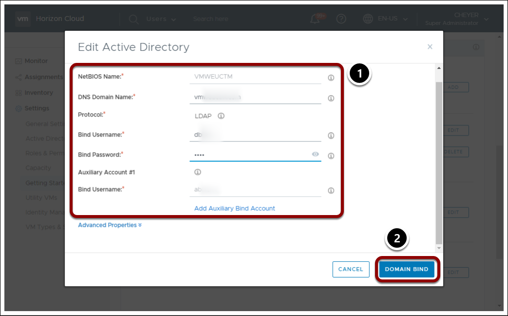

1. In the Register Active Directory window, provide information about the domain and accounts used for domain operations.

   - **NETBIOS Name**: Enter the Active Directory domain name.
   
   - **DNS Domain Name:** Enter the fully qualified Active Directory domain name.
   
   - **Protocol:** Accept the LDAP default.

   - **Bind Username:** Enter the user account in the domain to use as the primary LDAP bind account.

   - **Bind Password:** Enter the password associated with the Bind Username.
   
   - **Auxiliary Account #1:** In the Bind Username and Bind Password fields, enter a user account in the domain to use as the auxiliary LDAP bind account and its associated password.

   - For more information, see _VMware Horizon Cloud Service on Microsoft Azure Administration Guide_(```http://www.vmware.com/info?id=1439```).

2. In the lower right corner, click **Domain Bind**.


### **Task 4: Provide Domain Join Details**

   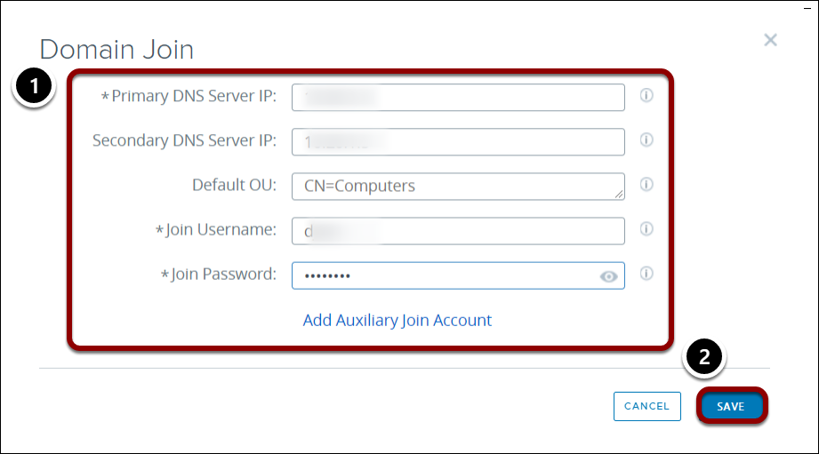

1. After configuration is complete, in the Domain Join window, provide the required data.

   - **Primary DNS Server IP:** Enter the IP address of the primary DNS Server.

   - **Note:** This DNS server must be able to resolve machine names inside of your Microsoft Azure cloud as well as resolve external names.

   - **Join Username:** Enter the user account in the Active Directory that has permissions to join systems to that Active Directory domain.

   - **Join Password:** Enter the password associated with the Join Username.

   - **Secondary DNS Server IP (Optional):** Enter the IP of a secondary DNS Server.

2. In the lower right corner, click **Save**.

### **Task 5: Add the Administrator**

   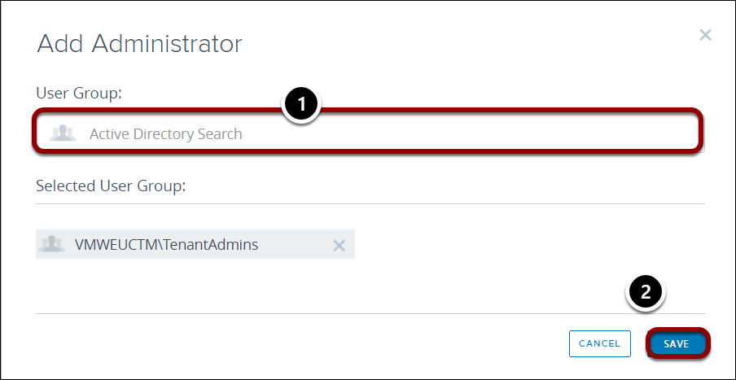
   
1. In the Add Administrator window, select an Active Directory User Group

2. In the lower right corner, click **Save**.

**Note:** Add the Active Directory group that includes the domain-join account, as described in the prerequisites. This action grants this group permissions to perform management actions in the Administration Console.


### **Task 6: Notice Change in Login Windows**

   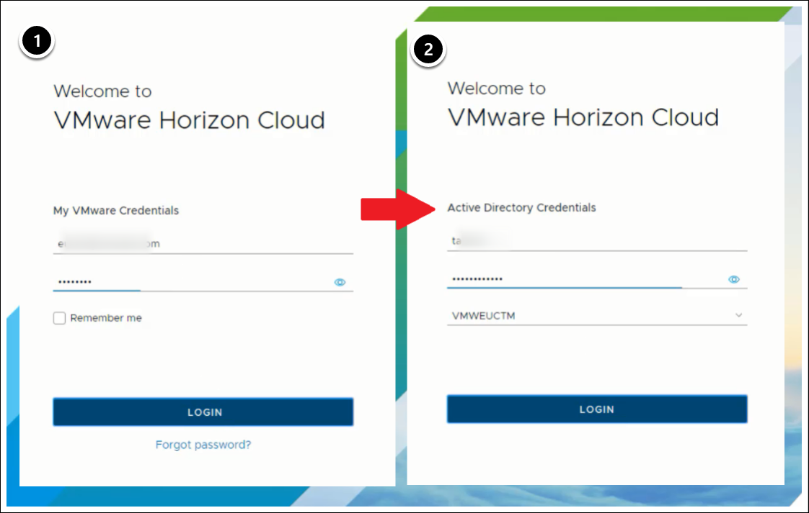

1. When you finish registering the pod with your Active Directory domain, the system returns you to the login window.

2. In the login window, you must log back in, first with your My VMware account, and then with the Active Directory credentials in the group that you just assigned.


### **Task 7: Join the VMware Customer Experience Improvement Program**

1. With the Horizon Cloud Service pod deployed and the bind operation complete, you can move the Yes/No slider to choose whether or not to join the VMware Customer Experience Improvement Program.

2. In the lower right corner, click **Save**.

For more information, see _VMware Horizon Cloud Service on Microsoft Azure Administration Guide_(```https://docs.vmware.com/en/VMware-Horizon-Cloud-Service/index.html```), and search the guide for **Register Your First Active Directory Domain**.


After deploying the Horizon Cloud Service pod and completing the bind operation, proceed to the next section to create golden images.

## **Exercise 1.3: Defining VM Types & Sizes**

You can optionally select which VM types and sizes to allow, add sizes to favorites, and customize how VM names are displayed.

Microsoft supports a wide variety of VM types and sizes, which you can learn about at _Sizes for Windows virtual machines in Azure_(```https://docs.microsoft.com/en-us/azure/virtual-machines/windows/sizes```). Instead of reviewing the entire list of available VM types, you can save time by creating your own sub-set of your favorite types and sizes. You can create this sub-set during deployment, and you can update it at any time afterward. If you set the option to choose your VM type, your end users can review the sub-set and quickly make their selection.

For more information, see General Purpose virtual machine sizes.

### **Task 1: Navigate to VM Types & Sizes**

   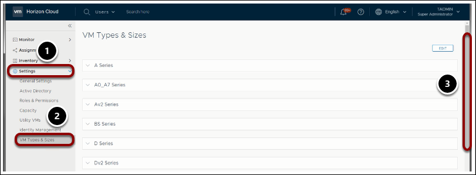

1. In Horizon Cloud, navigate to **Settings**.

2. Under Settings, select **VM Types & Sizes**.

3. Scroll through the long list of available settings.


### **Task 2: Expand a VM Type & Size**

   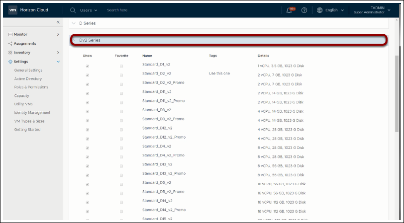

1. From the list of available VM types, select a type.
In this example, the Dv2 Series is selected, a general purpose type that is good for testing and development, small to medium databases, and low to medium traffic web servers with a balanced CPU-to-memory ratio.

2. Expand and examine the details of this series.

### **Task 3: Edit the VM Type**

   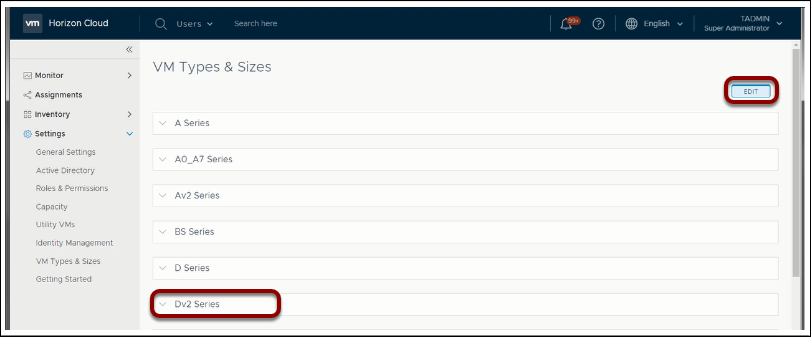

1. In the upper right, click **Edit**.

2. From the list, select the VM Type & Size that you want to define.


### **Task 4: Add a Tag**

   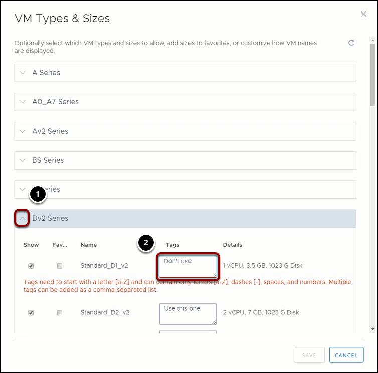

1. In the edit window of the VM Type & Size you selected, click the arrow to expand.

2. Under Tags, add a tag.

3. Make sure to use only letters, numbers, and spaces. As you can see, the use of an apostrophe is not allowed.

### **Task 5: Save the New Tag**

   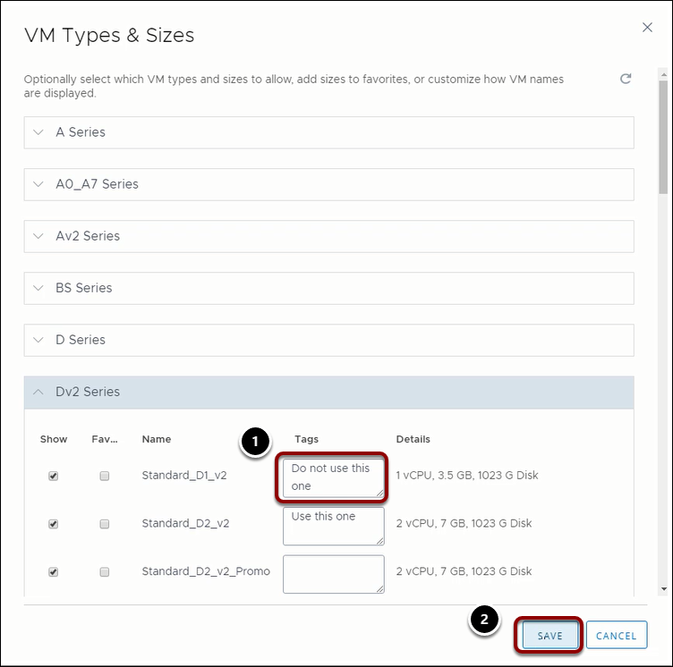

1. Enter a well-formed tag.

2. In the lower right, click **Save**.


### **Task 6: Verify Success**

   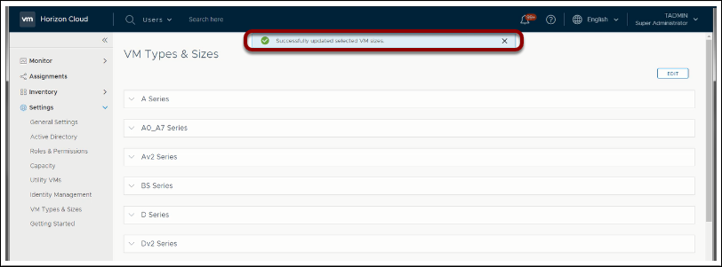

1. At the top of the VM Types & Sizes window, look for the banner that verifies success.

For more information, see _VMware Horizon Cloud Service on Microsoft Azure Administration Guide_(```https://docs.vmware.com/en/VMware-Horizon-Cloud-Service/index.html```), and search the guide for **Managing VM Types and Sizes for Farms and Assignments**.

After you finish creating and defining the subset of VM types and sizes that you want, you are ready to proceed to create a new image in the next exercise.


