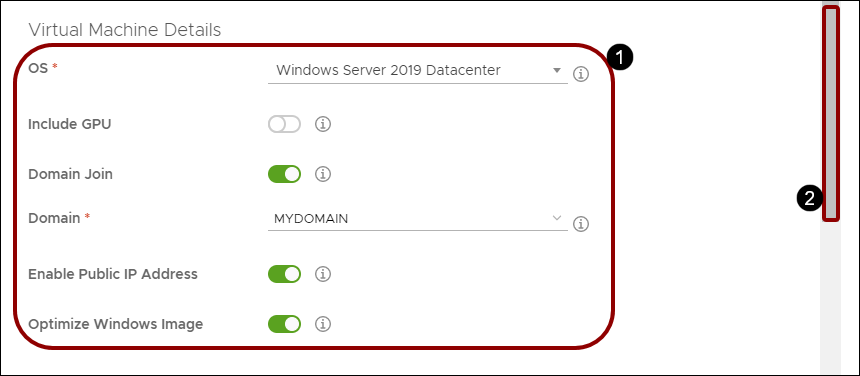
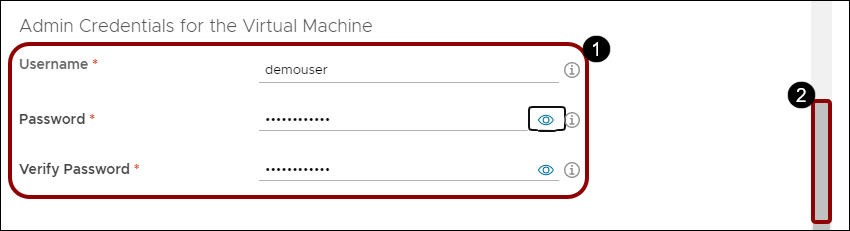
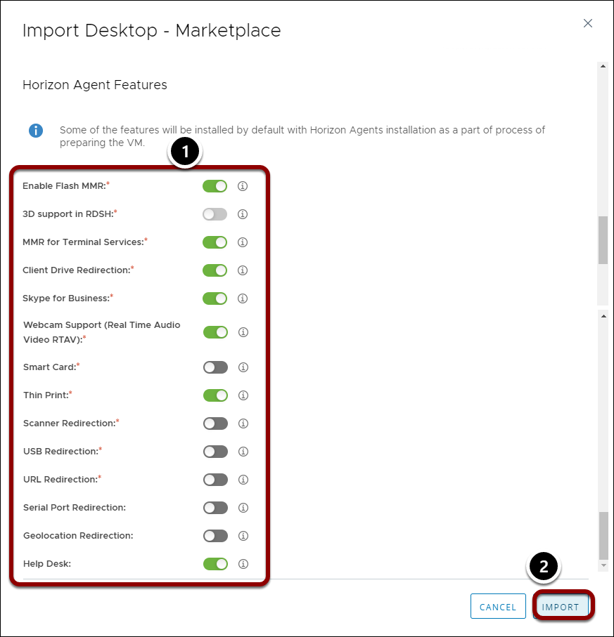
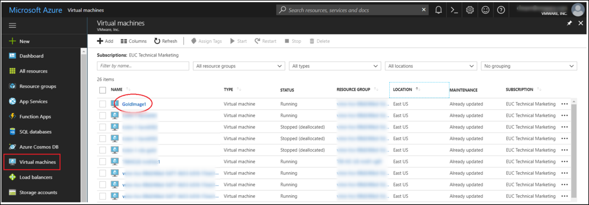
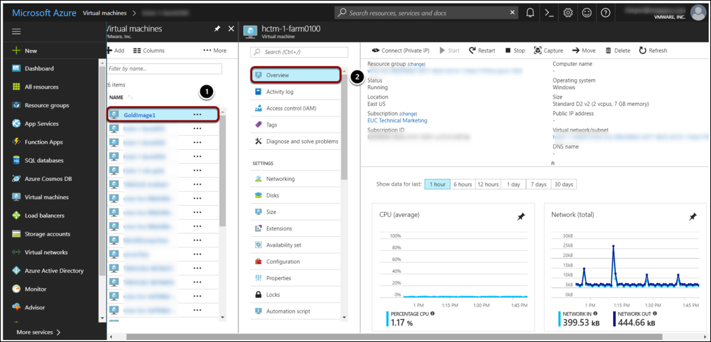
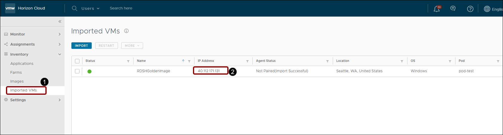
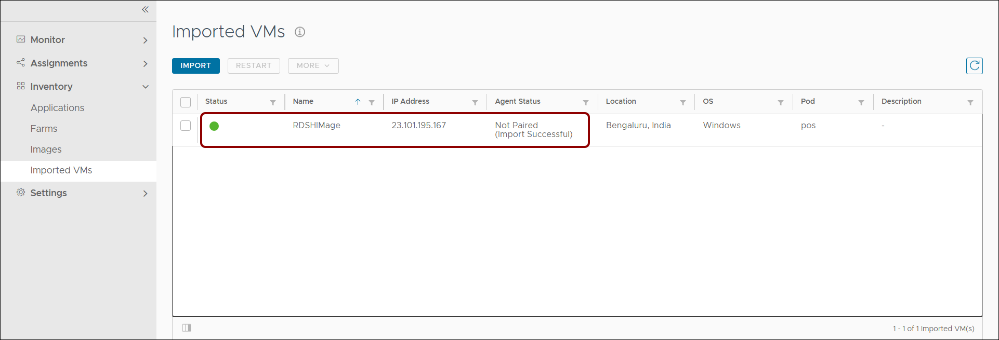
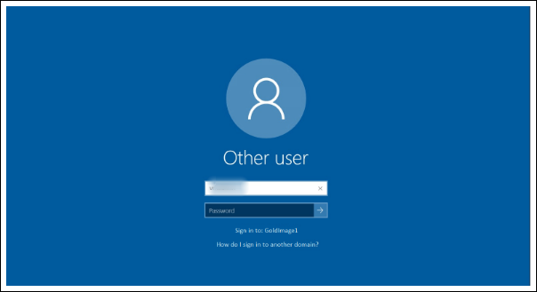

# **Exercise 2: Creating an Image**

**About Image Creation**

Microsoft provides a variety of VM templates in the Microsoft Azure Marketplace. Upon import, Horizon Cloud Service joins the VM to the domain, enables the RDS role, automates the Horizon and DaaS installations, and performs a bootstrap process, enabling secure pairing of the DaaS agent to the Horizon Cloud Service pod. All of this is automated, although the process can be performed manually if you want to convert an existing VM to a Horizon Cloud Service image yourself.

After the imported VM is configured with the necessary applications, Horizon Cloud Service converts the VM to an image by automatically running SYSPREP and sealing the OS. You can then use the image to create RDS session host farms and assign dedicated and floating VDI desktops.

**Note:** With the March 2020 release of Horizon Cloud on Microsoft Azure, you have access to new operating system types in your drop-down menu. For more information, see _Horizon Cloud on Microsoft Azure Support for Windows Virtual Desktop is Here_(```https://blogs.vmware.com/euc/2020/03/windows-virtual-desktop-support.html```) and _VMware Horizon Cloud Service Release Notes - v3 - March 2020_(```https://docs.vmware.com/en/VMware-Horizon-Cloud-Service/services/rn/horizon-cloud-service-relnotes-30.html```).


## **Exercise 2.1: Importing VMs from Microsoft Azure Marketplace**

In this exercise, you import a VM from the Microsoft Azure Marketplace, configure it with applications, and convert the VM to an image. With this image, you can then create new instances of the VM.

Later in this Tutorial, a set of exercises create an RDS server farm, for which you need an image with a server OS. Another set of exercises create a pool of VDI desktops, for which you need a Windows 10 desktop OS.

This exercise demonstrates deploying a new image using a desktop OS, and the process for deploying a server OS is virtually the same.

### **Task 1: Navigate to Imported VMs**

   

1. In the navigation panel of the Horizon Cloud Service Administration Console, click **Inventory**.

2. In the Inventory menu, click **Getting Started**.

3. In front of **Import VM** pane, click on **Add** button.


### **Task 2: Provide Destination Desktop Details**

   
 
1. In the Import Desktop Marketplace window under Destination Desktop, provide the following information:

  - **Location:** Select a location from the pop-up menu to get a list of pods available to store the desktop.

  - **Pod:** Select a pod to serve the desktop from.

2. Scroll down to the Desktop Details panel.


### **Task 3: Provide Desktop Details**

   
 
1. Under Desktop Details, provide the following information:

  - **OS:** Windows Server 2019 Datacenter

  - **Include GPU:** Slide **disable**

  - **Domain Join:** Slide **enable**
  
  - **Domain:** Select the Active Directory domain **<inject key="Domain Name" />** .

  - **Enable Public IP Address:** Select **Yes** to configure a public IP address so you can access the VM through an RDP connection.

  - **Optimize Windows Image:** Select **Yes** to optimize Windows on image import, which improves VM performance and capacity utilization.

2. Scroll down to the next panel.

### **Task 4: Provide Admin Credentials for the Desktop**

   

1. Under Admin Credentials for the Desktop, provide the required information:

  - **Username:** <inject key="AD VM Admin UserName" />

  - **Password:** <inject key="AD VM Admin Password" />

  - **Verify Password:** <inject key="AD VM Admin Password" />

2. Scroll to the next panel.


### **Task 5: Provide Properties**

   

1. In the Admin Credentials for the Desktop panel and the Properties panel, provide the required information.

  - **Name:** Enter a unique name for the golden image VM.

  - **Description:** You can enter an optional description.

2. Select **Advanced Options** to reveal the Horizon Agent Features panel.


### **Task 6: Provide Horizon Agent Details**

   

1. Under Horizon Agent Features, accept the default to install all features in the golden VM:

  - **Enable Flash MMR:** Redirects Flash multimedia content sent to the client system and plays in a Flash container window using the Flash Player ActiveX version.

  - **3D support in RDSH:** Provides support for vGPU-powered 3D RDS hosts.

  - **MMR for Terminal Services:** Redirects multimedia content directly to the client computer, which plays the media content, offloading the demand on the RDS desktop and improving performance optimization.

  - **Client Drive Redirection:** Allows you to share folders and drives on your local system with remote desktops and applications.

  - **Skype for Business:** Provides the ability to use the RDS desktops to make optimized audio and video calls with Skype for Business inside a virtual desktop without negatively affecting the virtual infrastructure and overloading the network.
  
  - **Webcam Support (Real Time Audio Video RTAV):** Allows you to run Skype, Webex, Google Hangouts, and other online conferencing applications on remote desktops with client local webcam and audio devices.

  **Smart Card:** Lets you redirect smart cards from client to remote sessions for both SSO and in-session leverage.

  - **Thin Print:** Allows you to print to any printer configured for your local computer from a remote desktop or application without installing printer drivers on the remote desktop.

  - **Scanner Redirection:** Redirects scanning and imaging devices that are connected to the client systems so those devices can be used with the desktop or remote application.

  - **USB Redirection:** Enables redirection of USB devices that are connected to your local client system so those devices can be used with the desktop or remote application.

  - **URL Redirection:** Collects performance data from monitored software and hardware objects in your Horizon environment and provides predictive analysis and real-time information about problems in your Horizon infrastructure.

  - **Serial Port Redirection:** Enables devices connected to serial ports on your local client system so those devices can be used with the remote desktop or application.

  - **Geolocation Redirection:** Allows the geolocation information of the client system to be used by Internet Explorer in remote desktops.

  - **Help Desk:** Select Yes to install the Help Desk.

2. In the lower right corner, click **Import**.


### **Task 7: Verify the VM Imported Successfully in Microsoft Azure**

   

1. When the success banner verifies that the import is complete, you can return to the Microsoft Azure portal.

2. Verify that the VM was successfully completed.

### **Task 8: Explore the Details of the Imported VM**

   

1. Select the imported VM.

2. Explore the details.


### **Task 9: Verify That the Imported VM Is Active**

   

1. Return to the Horizon Cloud Service Administration Console, where the imported VM is displayed.

2. Horizon Cloud Service automates the customization of the golden image VM, the green dot appears under Status, and the status changes to **Import Successful** when the process is complete.


For more information, see _VMware Horizon Cloud Service on Microsoft Azure Administration Guide_(```https://docs.vmware.com/en/VMware-Horizon-Cloud-Service/index.html```), and search the guide for **Create a Master Virtual Machine Automatically from the Microsoft Azure Marketplace**.

**Note:** It is also recommended that you optimize the image using the _VMware Windows Operating System Optimization Tool_(```https://labs.vmware.com/flings/vmware-os-optimization-tool```). This tool includes templates that you can customize to enable and disable Windows system services and features across multiple systems. Many Windows system services are enabled by default. You can disable services or features using the optimization tool, and improve performance by eliminating unnecessary services or features. For instructions, see the _VMware Windows Operating System Optimization Tool Guide_(```https://www.vmware.com/content/dam/digitalmarketing/vmware/en/pdf/techpaper/vmware-view-virtual-desktops-windows-optimization.pdf```).

When you finish importing the Windows 10 desktop OS VM, proceed to the next exercise to customize it.


## **Exercise 2.2: Customizing the Windows VM**

You can customize the Windows operating system of the new golden image VM, set wallpapers, and install applications to provide to your end users. If you enabled a public IP address for the golden image VM, you can connect to the VM by using the IP address displayed in the Imported VMs window in an RDP client like Microsoft Remote Desktop Connection.

### **Task 1: RDP to a Public IP**

   

Depending on your configuration, you can use either a private or public IP address to RDP to the new golden image VM.

   

1. Use the IP address of the golden image VM to connect to the RDS-enabled Windows Server operating system.

  - **Public IP address:** RDP into it using that IP address.

  - **Private IP address:** RDP into it by one of these two methods:
    - Use another VM in your Microsoft Azure subscription that does have a public IP address, and do an outbound RDP into the golden image VM.
    - Use your VPN and RDP into the golden image VM over your corporate network.

2. Log in to the RDS-enabled Windows Server operating system using the credentials that you set up when creating the golden image VM, and enter the username as \username.

3. Copy the IP address.


### **Task 2: Log in with a Local Administrator Account**

   

1. When the login window is displayed, you can log in to Horizon Client.

2. Once you are connected, you can add end-user applications and video GPU drivers, and any other required configurations to the VM.

3. Install the third-party applications and drivers that you want available to run in the multi-user RDS desktop environment.

  - In the Windows Server operating system, right-click the Start button and click Command Prompt (Admin) to open a command prompt as an administrator.

  - In the command prompt, use the following command to determine the install mode of the server:
change user /query

  - The server is in RD-Execute mode if you receive the following response:
Application EXECUTE mode is enabled

  - In the command prompt, use the following command to switch the server into RD-Install mode, a special mode to install applications so they can run in a multi-user environment:
change user /install

  - Install the third-party user applications you want to provide to your end users in their RDS desktops or as remote applications.
  
  - Return to the command prompt, and issue the following command to switch the server back into RD-Execute mode:
change user /execute

4. In the operating system, install any custom drivers you want in the RDS desktops, such as GPU-backed VMs that leverage NVIDIA GPUs.

5. Make any customizations or configurations you want to the RDS desktops, such as adding custom wallpaper, setting default fonts or colors or themes, adjusting the taskbar default settings, and so on.

6 When you finish, sign out of the operating system. Note: Do not shut down the Windows operating system, but instead, use Sign Out.

For more information, see _VMware Horizon Cloud Service on Microsoft Azure Administration Guide_(```https://docs.vmware.com/en/VMware-Horizon-Cloud-Service-on-Microsoft-Azure/index.html```), and search the guide for **Customize the Guest Windows Operating System of the Master Image Virtual Machine**.

After you finish customizing the golden image VM, proceed to the next exercise to convert the golden image VM to an assignable image.


## **Exercise 2.3: Converting the Golden VM to an Image**

When the golden image VM is ready, it is made assignable. For this exercise, you can use any VM with the Agent and bootstrap process already complete.

### **Task 1: Start Creating a New Image**

   

1. In the Horizon Cloud Service Administration Console navigation bar on the left, select **Inventory**.

2. In the Inventory menu, select **Images**.

3. In the Images window, click **New**.

### **Task 2: Provide Desktop-to-Image Details**

   


1. In the New Image window under **Convert Desktop to Image**, provide the following information:

  - **Location:** Select the location to get a list of pods available to store the desktop.

  - **Pod:** Select the pod to serve the desktop from.

  - **Desktop:** From the list of desktops that can be converted to an image, select the desktop you want.

### **Task 3: Provide OS Properties Details**

   

1. Under **OS Properties**, provide the following information:

  - **Image Name:** Provide a unique name to the image that will be used as the operating system on your virtual desktops.

  - **Company Name:** Enter an identifying name, which is used as the default in desktops that are created with this image.

  - **Timezone:** Set the time zone, to be the default time zone for all desktops created with this image.


### **Task 4: Provide Admin Credentials**

   

1. Under **Admin credentials for the desktop**, provide the account credentials for a valid administrator account in the selected image VM. Make sure to follow the complexity standards and other limitations.

  - **Username:** **INJECT**

  - **Password:** **INJECT**

  - **Note:** These credentials are the user name and password that were entered in the wizard when the golden VM was created in the Imported VMs window.

2. In the lower right corner, click **Publish**.


### **Task 5: Wait for the Published Status**

   

  - Wait until the status changes to **Published** to use the assignable image for creating a farm.


For more information, see _VMware Horizon Cloud Service on Microsoft Azure Administration Guide_(```https://docs.vmware.com/en/VMware-Horizon-Cloud-Service-on-Microsoft-Azure/index.html```), and search the guide for **Convert a Configured Master Virtual Machine to an Assignable Image**.

After you finish importing and customizing a golden image VM and converting it into an assignable image, proceed to the next section to use the assignable image.

If the golden image you created has a Windows 10 OS, proceed to _Assigning Resources_(```https://techzone.vmware.com/quick-start-tutorial-vmware-horizon-cloud-service-microsoft-azure```) to create VDI desktop pool.

If the golden image you created has a server OS, proceed to _Deploying a Farm_(```https://techzone.vmware.com/quick-start-tutorial-vmware-horizon-cloud-service-microsoft-azure```) to create an RDSH farm.

