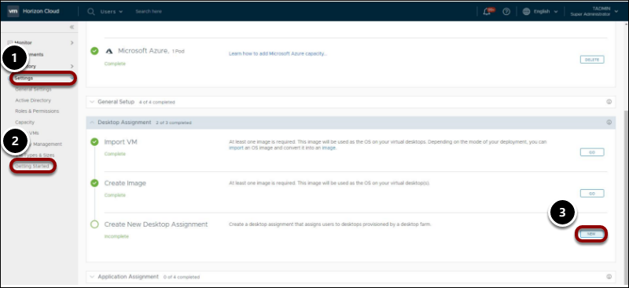
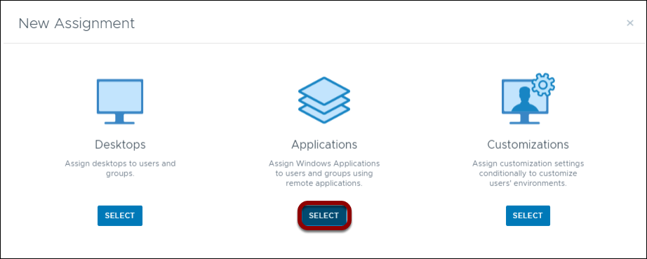
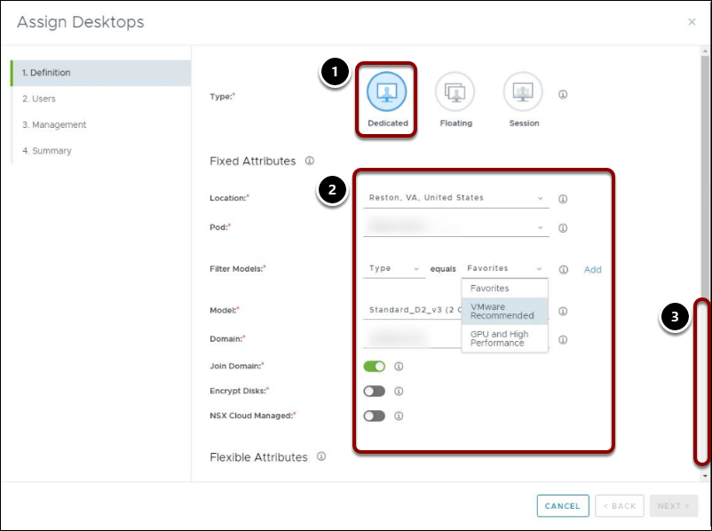
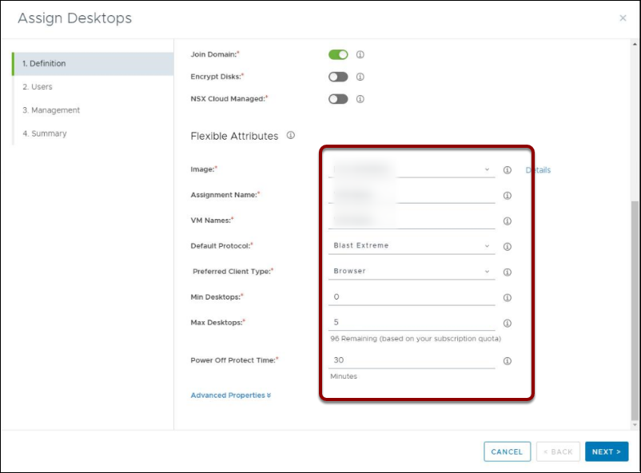
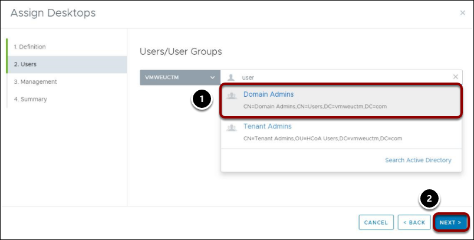
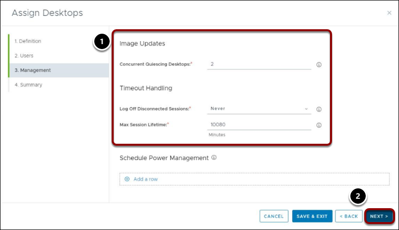
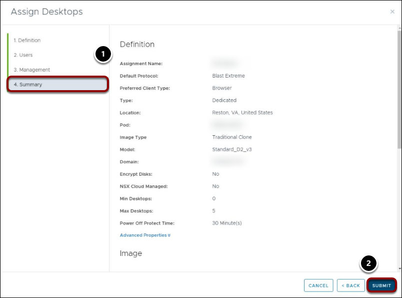

# Exercise 4: Assigning Resources

## About Assignments

After you finish creating images and farms, you are ready to assign desktops and applications to users. There are three main types of assignments:

  - **Desktop Assignments** - You can use automation that is built into the system to perform basic VDI agent updates to floating and dedicated desktops. VDI desktops are powered off and deallocated when not in use, which reduces infrastructure costs. You can also leverage the system to support RDSH session desktops, to be accessed by remote users over a network connection. For more information about floating and dedicated desktop assignments, see [VMware Horizon Cloud May 2018 Release Technical What's New Overview](https://www.youtube.com/watch?t=2m56s&v=mSTBrUFFLDc&feature=youtu.be).
  - **Application Assignments** - You can assign Windows applications to users or groups using remote applications, which can be hosted on the RDS farms you created earlier. This enables you to provide the resources your users need when they need them, and avoids the cost of maintaining idle resources just waiting to be used.
  - **Customization** - You can customize your end user environments by making URL redirection assignments. You do this by configuring the client-to-agent URL redirection rules that tell the Horizon Client to redirect URLs from the end user's client machine to a desktop or application within your Horizon Cloud environment. For more information about customization, see *Assigning Customizations* in [Quick-Start Tutorial for VMware Horizon Cloud with Hosted Infrastructure](https://docs.vmware.com/en/VMware-Horizon-Cloud-Service/index.html).

## Exercise 4.1: Checking Desktop Capacity Allocation

Before you assign a desktop to a user or group, it is best practice to check the desktop capacity allocation.

### Task 1: Navigate to Dashboard

   

1. In the navigation bar on the left, click **Monitor**.
2. In the Monitor menu, click **Dashboard**.

### Task 2: Examine Utilization Data

   
   
1. Scroll down to the **Utilization** pane, and hover over the diagram. In this example, 7% of the allocated capacity is being used. Utilization is measured as follows:
  - **Horizon 7:** Average CPU, memory, and storage usage from vCenter(s) hosting connected Horizon 7 pods
  - **Microsoft Azure:** Desktop percentage is the number of connected to allocated desktops across Azure pods. Capacity percentage is number of allocated desktops.

2. In the bar graph, you can select and deselect metrics to hide data and enhance focus.

### Task 3: Navigate to Capacity Window

   
   
1. In the navigation bar on the left, select **Settings**.
2. In the Settings menu, click **Capacity**.
3. In the Capacity window, you can adjust your view by location or type.
4. Under Status, click the pod to see a detail summary.

### Task 4: View Capacity Allocation Details

   
   
1. Scroll down the Summary window to examine the capacity and utilization data:
  - **Capacity Utilization:** The number of desktops currently in use, divided by the number of desktops possible to use, tells you the capacity percentage by pod.
  - **Desktop & App Utilization:** The number of active sessions, divided by the number of sessions possible, provides you with a measure of user activity in terms of sessions in use, compared to maximum sessions possible.

2. Note the amount used so that you can compare after assigning the desktop.

For information about the capacity model, see [Service Description: VMware Horizon® Cloud Service™ on IBM Cloud](https://www.vmware.com/content/dam/digitalmarketing/vmware/en/pdf/support/vmware-horizon-cloud-hosted-service-description.pdf).

After verifying that the Desktop Capacity Allocation is sufficient, you can proceed to the next exercise to assign a desktop and see how the capacity allocation is affected.

## Exercise 4.2: Assigning Applications from the Farm

To assign applications to users and groups:

### Task 1: Assign New

   
   
1. In the navigation bar on the left, click **Settings**.
2. Under Settings, click **Getting Started**.
3. Under Desktop Assignment, to the right of Create New Desktop Assignment, click **New**.

### Task 2: Select Applications

   

  - After verifying that the Desktop Capacity Allocation is sufficient, you can proceed to the next exercise to assign a desktop and see how the capacity allocation is affected.

### Task 3: Define Fixed Attributes

   
   
1. In the Definitions tab of the New Application Assignment window, select the Type.

2. Under Fixed Attributes, provide the following information:
  - **Location:** From the pop-up list, select the location.
  - **Pod:** From the pop-up list, select the pod containing the farm you want to choose.
  - **Filter Models:** From the pop-up list, select **Type** equals **VMware Recommended**.
  - **Model:** From the pop-up list, select the model.
  - **Domain:** From the pop-up list, select the domain name.
  - **Join Domain:** Slide right to enable.
  - **Encrypt Disks:** Leave disabled.
  - **NSX Cloud Managed:** Leave disabled.

3. Scroll down to the Flexible Attributes section.

### Task 4: Define Flexible Attributes

   
   
1. In the Flexible Attributes panel, provide the following information:
  - **Images:** Accept the image.
  - **Assignment Name:** Enter a friendly name to identify this assignment. The name must start with a letter, and contains only letters, dashes, and numbers.
  - **VM Names:** All VMs in this assignment inherit the assignment name, and include an appended number, such as Server DTAfloating 1, Server DTAfloating 2, and so on.
  - **Default Protocol:** From the pop-up list, select [Blast Extreme](https://docs.vmware.com/en/VMware-Horizon-7/7.6/horizon-architecture-planning/GUID-F64BAD49-78A0-44FE-97EA-76A56FD022D6.html) as the default protocol for end user sessions.
  - **Preferred Client Types:** From the pop-up list, select **Browser**.
  - **Min Desktops:** Enter the minimum number of desktops to be allowed.
  - **Max Desktops:** Enter the maximum number of desktops to be allowed.
  - **Power Off Protect Time:** Enter the number of minutes.

2. In the lower right, click **Next**.

### Task 5: Add Users

   
   
1. In the Users tab, select the users and groups to assign. **Note:** You can click the **Active Directory** search field. If no results are found, click **Search Active Directory**.

2. In the lower right corner, click **Next**.

### Task 6: Configure Management

   
   
1. In the Management tab, accept the defaults.
2. In the lower right, click **Next**.

### Task 7: Verify Summary Information

   
   
1. In the Summary tab, review and verify that your settings are correct and complete.
2. In the lower right corner, click **Submit**.

### Task 8: Verify Success
