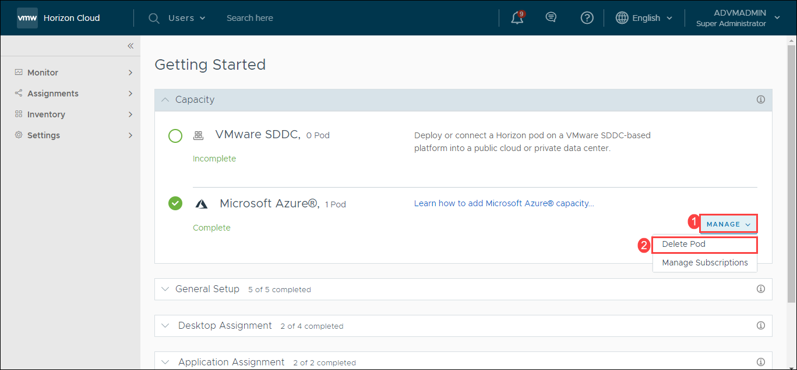
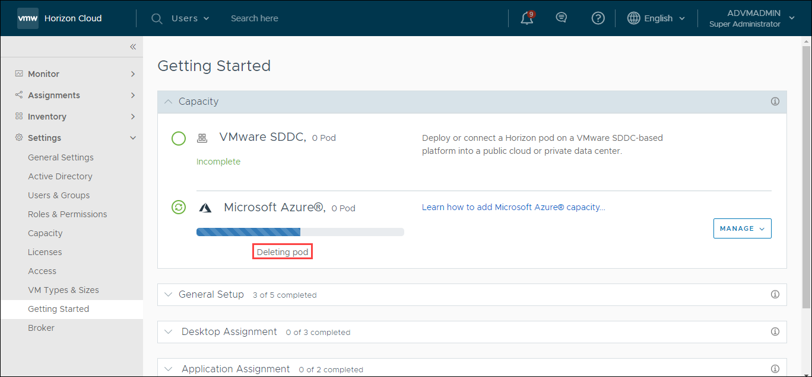
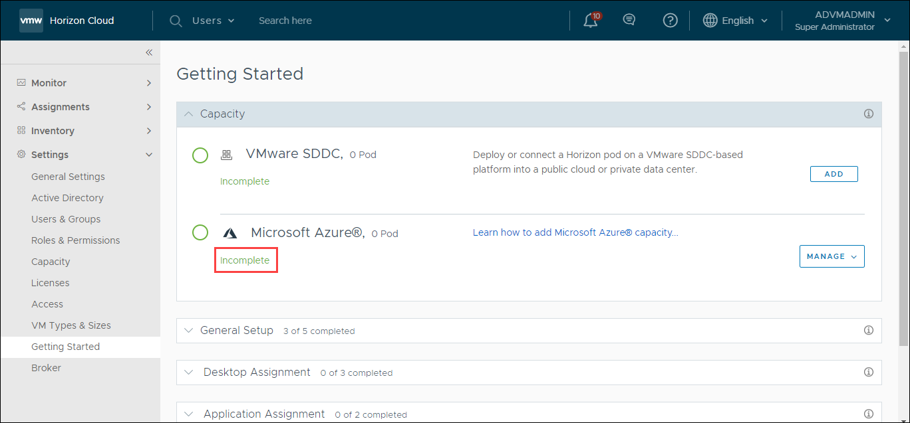
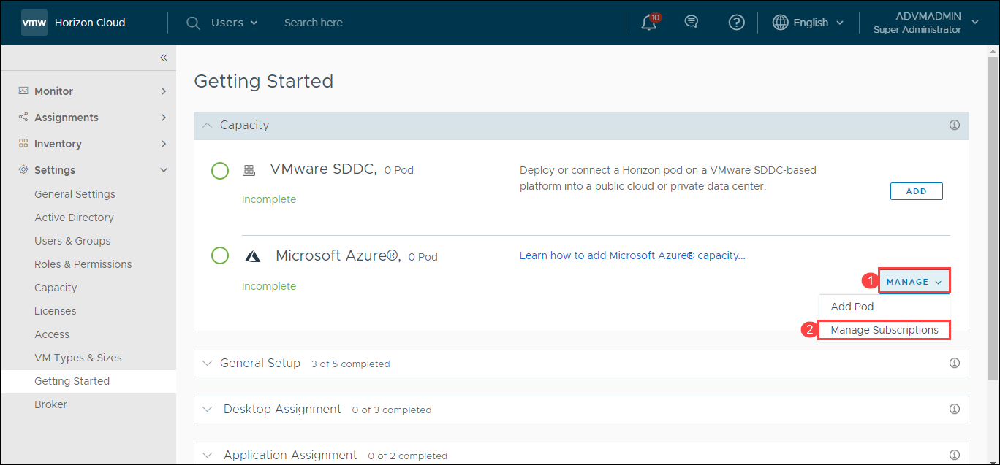
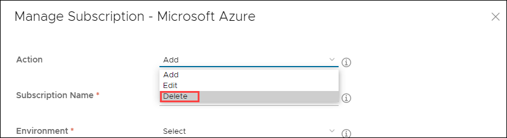
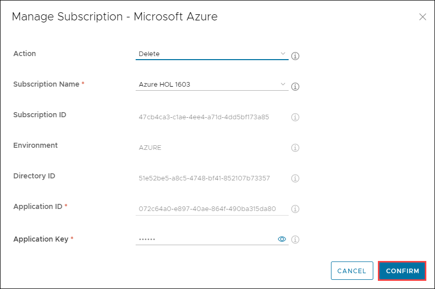
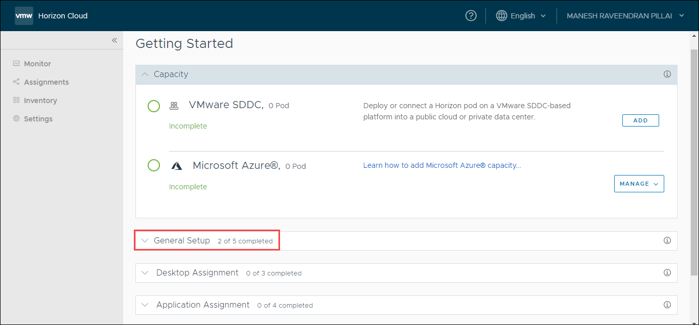
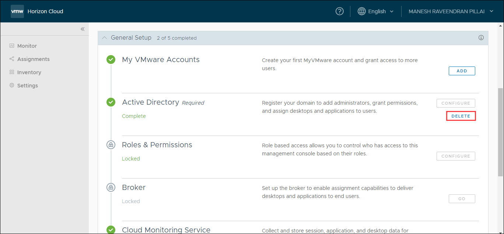
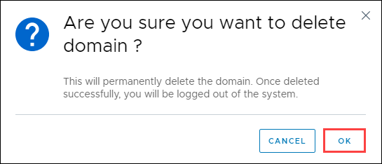

# **Exercise 5: Cleanup of VMware Horizon Account**

1. On the Getting Started page, Click on **Manage**.

2. From the drop down select **Delete Pod**.

   
   

3. Now enter the name of the pod and click on **Delete**.

   

4. You will get the screen above, with the status “Deleting POD”.

   
   

5. Once the deletion is complete (takes about 30 minutes), the page will be as above (Showing 0 pods and status as incomplete).

   

6. Click on **Manage** and **Manage Subscriptions**.

   
   

7. Click on the Action drop down and choose **Delete**.

   
   

8. Click on **Confirm**.

   
   

9. Expand the **General Setup** section.

   
   

10. In the **Active Directory setup**, click on **Delete**.

   
   

11. In the confirmation dialogue box, select **OK**.

   
   

12. Once you click OK, you will be **logged out** from the portal. 
   
