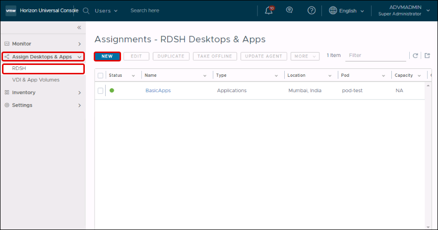
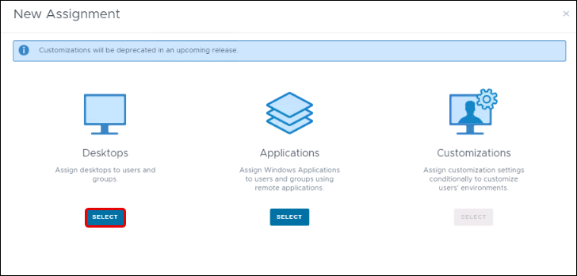
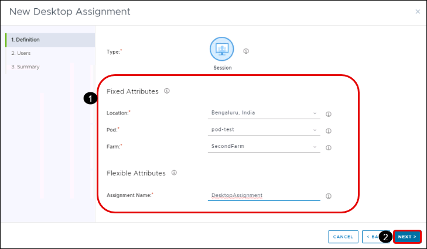
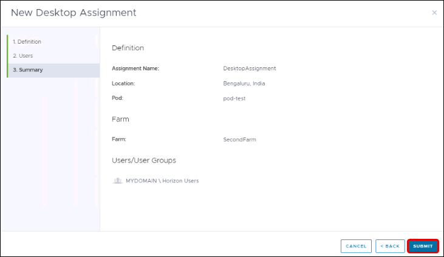
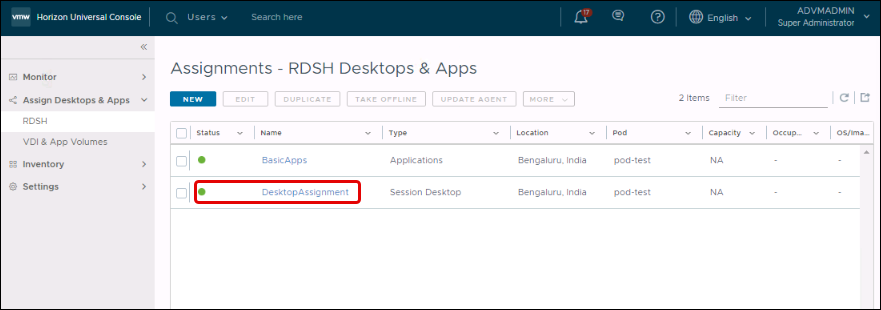
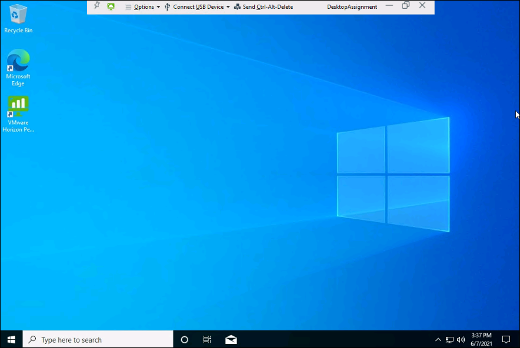

# **Exercise 6: Assigning Resources**

In this exercise we will be assigning the Session Desktop to the users and will be accessing them using Horizon Client.

## **Exercise 6.1: Creating RDSH Session Assignments**

### **Task 1: Assign New**

1. In the navigation pane on the left, click **Assign Desktops & Apps** and select **RDSH** from dropdown menu.
2. In the Assignments window, click **New**.

   

### **Task 2: Select Desktops**

   

In the New Assignment window, select **Desktops**.

### **Task 3: Provide Fixed Attributes**

1. Under Fixed Attributes, provide the following information:
  - **Location:** Select the location of the pod where the session desktops should be provided.
  - **Pod:** Select the pod.
  - **Farm:** Select **SecondFarm**.

2. Under **Flexible Attributes**, enter the **Assignment Name**, a memorable name to help end users identify this assignment, using only letters, hyphens, and numbers.

   

3. In the lower right corner, click **Next**.

### **Task 4: Select Users and Groups**
   
1. In the Users tab, search **Horizon users** and select it for this assignment.

   

2. In the lower right corner, click **Next**.

### **Task 5: Verify the Summary**
   
1. In the Summary tab, review the configuration summary.

   

2. In the lower right corner, click **Submit**.

### **Task 6: Verify in the Assignments Window**
   
1. Wait while the system configures the farm's server instances to provide session desktops to the selected users. The green dot indicates that the assignment is active.

   

For more information, see [VMware Horizon Cloud Service on Microsoft Azure Administration Guide](https://docs.vmware.com/en/VMware-Horizon-Cloud-Service/index.html).

### **Task 7: Launch Horizon Client to access the Session Desktop**

1. In AdVM, open VMHorizon Client given on the desktop.

   

2. Now on the Horizon Client double click on **vdi.mydomain.local**.

   

3. Enter the password for **vdiuser1** and click on **Login**.

   - Password: <inject key="all Account Password" props="{\&quot;enableCopy\&quot;:true,\&quot;style\&quot;:{\&quot;fontWeight\&quot;:\&quot;bold\&quot;}}" />

   
   
4. Double click on the **DesktopAssignment** to launch the Session Desktop.

   

5. Now the Desktop session will launch and will be ready to use.

   

6. To close the Session Desktop click on the **X** icon.

   

7. Close the Horizon Client.

Click on the **Next** button from lower right corner of the guide to move on the next page.
