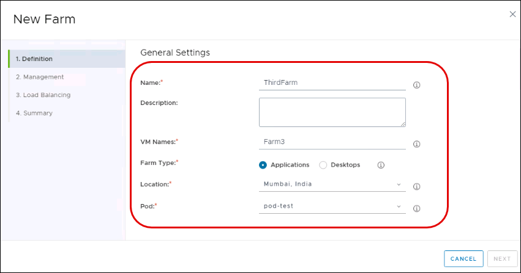

# **Exercise 7: App Volumes**

## **Exercise 3.1: Creating a Application Farm for App Volume**

When the new image has been published, you can use it to create farms.

### **Task 1: Create a New Farm**

   

1. In the navigation bar of Horizon Cloud Service Administration Console, select **Inventory**.

2. Select **Farms**.

3. In the Farms window, click **New**.

### **Task 2: Provide General Settings**

   

1. In the New Farm window, **Definition** tab, provide the following information, and then scroll down.
  
   - **Name:** **ThirdFarm**

   - **Description:** Enter an optional description to help identify the farm in the system.

   - **VM Names:** **Farm3**

   - **Farm Type:** Select **Applications**
   
      a. **Desktops:** Provides session-based desktops, b. **Applications:** Provides access to remote applications
 
   - **Location:** Select the location in which you created pod in Exercise 1.
 
   - **Pod:** Select **pod-test**.
 
2. Scroll down to provide additional general settings.

### **Task 3: Provide More General Settings**

   

1. Provide the following additional general settings information:

  - **Specify VM Subnet(s):** Toggle off the switch.

  - **Filter Models:** From first drop-down select **Tag** then from the equals drop-down select **VMware recommended**
  
  - **Model:** Select the Azure VM size for the Farm. Some VM sizes are not available in all regions.
  
  - **Disk Type:** Standard HDD
  
  - **Disk Size:** 127 GiB
  
  - **Image:** Select an available RDSH image from the list. Images that do not match the desktop model disk size are not displayed.
  
  - **Preferred Protocol:** **Blast Extreme**

   

  - **Preferred  Client Type:** Horizon Client

  - **Join Domain:** Enabled

  - **Encrypt Disks:** Leave it **Disabled**

  - NSX Cloud Management: Leave it **Disabled**

2. Scroll to the **Farm Size** section.

### **Task 4: Set Farm Size**

   

1. In the **Farm Size** pane, provide the information to enable the farm to automatically scale up or down on demand:
  - **Min Servers:** 1
  - **Max Servers:** 3
  **Note:** The minimum number of server instances is initially powered on. As demand increases, additional servers are powered on until reaching the maximum. As end-user demand shrinks, servers are powered off until reaching the minimum. Each server is completely empty of user sessions before the system powers it off.
  - **Power Off Protect Time**: Accept the default of 30 minutes that a VM is protected from powering off after powering on due to a headroom error.
  - **Sessions per Server:** Accept the default values.
  **Note:** This number cannot be updated after the farm is created.
  
2. **Do you have a valid license for this Windows OS:** Enable it and click on the check box saying **I confirm that I have an eligible license for this Windows OS.**

### **Task 5: Provide Advanced Properties**

   

1. Under **Advanced Properties**, provide the following information:

  - **Computer OU**: <inject key="horizon OU path" props="{\&quot;enableCopy\&quot;:true,\&quot;style\&quot;:{\&quot;fontWeight\&quot;:\&quot;bold\&quot;}}" />
  
  - **Run Once Script**: Leave blank

2. In the lower right corner, click **Next**.

### **Task 6: Provide Rolling Maintenance Information**

   

1. In the Management tab, provide the information for Rolling Maintenance.

   - **Maintenance Type:** Select the maintenance type, either according to:
   
      a. **Scheduled:** Select a time cadence such as daily or weekly.
      
      b. **Session:** Specify the number of user sessions at which the farm should begin rolling maintenance.
   
   - **Recurrence:** Indicate the type of recurrence.
   
   - **Recurrence Day:** Indicate the day of the week.
   
   - **Scheduled Hour:** Indicate the hour of the recurrence.
   
   - **Concurrent Quiescing Servers:** Indicate the number of concurrent quiescing servers.
   
   - **VM Action:** Select the action that the system should perform on servers that are undergoing maintenance:
   
      a. **Restart:** Restart the sever VMs.
      
      b. **Rebuild:** Delete server VMs and then re-provision them from their RDS desktop image.

2. Scroll to the Power Management panel.
