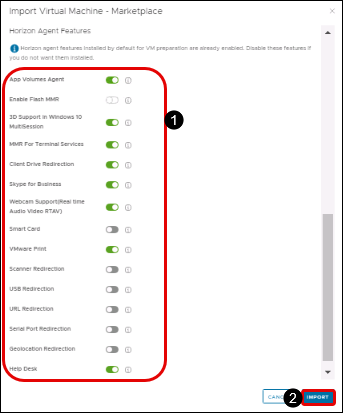
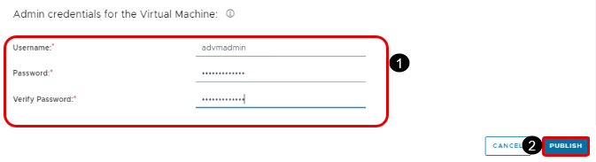

# **Exercise 7: App Volumes**

## **Exercise 7.1: Importing VMs from Microsoft Azure Marketplace**

In this exercise, you import a VM from the Microsoft Azure Marketplace, configure it with applications, and convert the VM to an image. With this image, you can then create new instances of the VM.

Later in this Tutorial, a set of exercises create an RDS server farm, for which you need an image with a server OS. Another set of exercises create a pool of VDI desktops, for which you need a Windows 10 desktop OS.

This exercise demonstrates deploying a new image using a desktop OS, and the process for deploying a server OS is virtually the same.

### **Task 1: Navigate to Imported VMs**

1. In the navigation panel of the Horizon Cloud Service Administration Console, click **Inventory**.

2. In the Inventory menu, click **Imported VMs**.

3. In Imported VMs page, click on **IMPORT** button.

   

### **Task 2: Provide Destination Desktop Details**
 
1. In the Import Desktop Marketplace window under Destination Desktop, provide the following information:

  - **Location:** Select the location we used while creating Pod in Exercise 1.

  - **Pod:** Select **pod-test**

2. Scroll down to the Virtual Machine Details panel.

   

### **Task 3: Provide Desktop Details**

**Note:** Please wait until the drop down against the **OS** field is loaded with a value

 
1. Under Desktop Details, provide the following information:

  - **OS:** Windows 10 Enterprise, 2004

  - **Include GPU:** Slide **disable**

  - **Domain Join:** Slide **enable**
  
  - **Domain:** Select the Active Directory domain **<inject key="Domain NETBIOS Name" />** .

  - **Enable Public IP Address:** Select **Yes** to configure a public IP address so you can access the VM through an RDP connection.

  - **Optimize Windows Image:** **Enable** it to optimize Windows on image import, which improves VM performance and capacity utilization.

2. Scroll down to the next panel.

   

### **Task 4: Provide Admin Credentials for the Desktop**

1. Under Admin Credentials for the Desktop, provide the required information:

  - Username: **<inject key="AD VM Admin UserName" />**

  - Password: **<inject key="AD VM Admin Password" />**
  
  - Verify Password: **<inject key="AD VM Admin Password" />**

    

2. Scroll to the next panel.

   
### **Task 5: Provide Properties**

1. In the Admin Credentials for the Desktop panel and the Properties panel, provide the required information.

  - **Name:** Enter **Win10AppVolume**

  - **Description:** You can enter an optional description.

2. Select **ADVANCED OPTIONS** to reveal the Horizon Agent Features panel.

   

### **Task 6: Provide Horizon Agent Details**

1. Under Horizon Agent Features, accept the default to install all features in the golden VM:

  - **App Volume Agent:** Slide to **Enable** it.

    >**Note:** Installs the App Volumes Agent on the desktop.

  - **Enable Flash MMR:** Redirects Flash multimedia content sent to the client system and plays in a Flash container window using the Flash Player ActiveX version.

 
 - **3D support in Windows 10 MultiSession:** Slide to **Disable** it.
  
   >**Note:** Provides support for vGPU-powered 3D RDS hosts.

 
 - **MMR for Terminal Services:** Slide to **Enable** it. 
  
   >**Note:** Redirects multimedia content directly to the client computer, which plays the media content, offloading the demand on the RDS desktop and improving performance optimization.

 
 - **Client Drive Redirection:** Slide to **Enable** it.
  
   >**Note:** Allows you to share folders and drives on your local system with remote desktops and applications.

  - **Skype for Business:** Provides the ability to use the RDS desktops to make optimized audio and video calls with Skype for Business inside a virtual desktop without negatively affecting the virtual infrastructure and overloading the network.
  
  - **Webcam Support (Real Time Audio Video RTAV):** Allows you to run Skype, Webex, Google Hangouts, and other online conferencing applications on remote desktops with client local webcam and audio devices.

  
  - **Smart Card:** Slide to **Disable** it
  
    >**Note:** Lets you redirect smart cards from client to remote sessions for both SSO and in-session leverage.

  
  - **VMware Print:** Allows you to print to any printer configured for your local computer from a remote desktop or application without installing printer drivers on the remote desktop.

  - **Scanner Redirection:** Redirects scanning and imaging devices that are connected to the client systems so those devices can be used with the desktop or remote application.

 
 - **USB Redirection:** Enables redirection of USB devices that are connected to your local client system so those devices can be used with the desktop or remote application.

 
 - **URL Redirection:** Collects performance data from monitored software and hardware objects in your Horizon environment and provides predictive analysis and real-time information about problems in your Horizon infrastructure.

  - **Serial Port Redirection:** Enables devices connected to serial ports on your local client system so those devices can be used with the remote desktop or application.

  - **Geolocation Redirection:** Allows the geolocation information of the client system to be used by Internet Explorer in remote desktops.

  - **Help Desk:** Slide and **Enable** it to install the Help Desk.

2. In the lower right corner, click **IMPORT**.

   

**Note: This process will take approximately 10 minutes to complete.**

3. Wait for the agent status to turn **Import successful** under Imported VM section before proceeding with the lab. Once the import is successful, a **Green dot** appears under Status.

   
   

**## Exercise 7.2: Converting the App Volume VM to an Image**

### **Task 1: Start Creating a New Image**

1. In the Horizon Cloud Service Administration Console navigation bar on the left, select **Inventory**.

2. In the Inventory menu, select **Images**.

3. In the Images window, click **New**.

   

### **Task 2: Provide Desktop-to-Image Details**

1. In the New Image window under **Convert Desktop to Image**, provide the following information:

  - **Location:** Select the location to get a list of pods available to store the desktop.

  - **Pod:** Select the pod **pod-test**.

  - **Desktop:** From the list of desktops that can be converted to an image, select **Win10AppVolume**
  
   

### **Task 3: Provide OS Properties Details**

1. Under **OS Properties**, provide the following information:

  - **Image Name:** Provide a unique name to the image that will be used as the operating system on your virtual desktops.

  - **Company Name:** Enter an identifying name, which is used as the default in desktops that are created with this image.

  - **Timezone:** Set the time zone, to be the default time zone for all desktops created with this image.

   

### **Task 4: Provide Admin Credentials**

1. Under **Admin credentials for the desktop**, provide the account credentials for a valid administrator account in the selected image VM. Make sure to follow the complexity standards and other limitations.

  - Username: **<inject key="AD VM Admin UserName" />**

  - Password: **<inject key="AD VM Admin Password" />**
  
  - Confirm Password: **<inject key="AD VM Admin Password" />**

  - **Note:** These credentials are the user name and password that were entered in the wizard when the App Volume VM was created in the Imported VMs window.

   

2. In the lower right corner, click **Publish**.

### **Task 5: Wait for the Published Status**

1. Wait until the status changes to **Published** to use the assignable image for creating a farm.

   

For more information, see [_VMware Horizon Cloud Service on Microsoft Azure Administration Guide_](https://docs.vmware.com/en/VMware-Horizon-Cloud-Service-on-Microsoft-Azure/index.html), and search the guide for **Convert a Configured Master Virtual Machine to an Assignable Image**.
