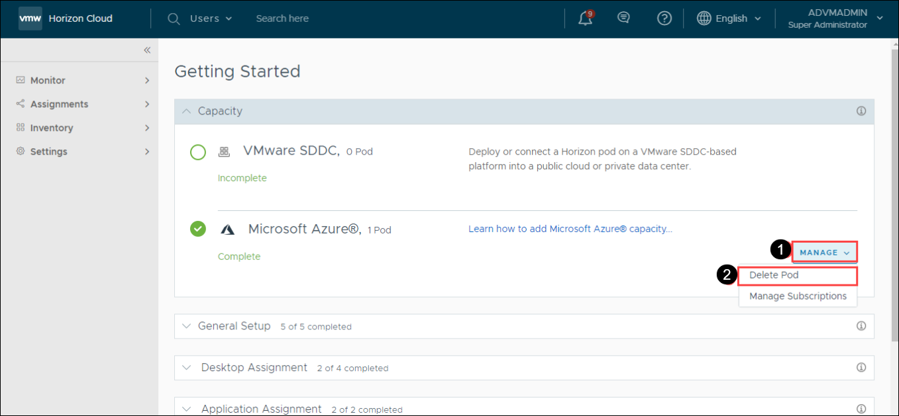
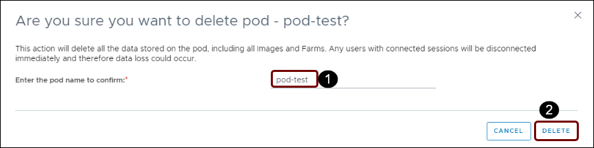

# **Exercise 9: Deleting POD**

1. On the Getting Started page, Click on **Manage**.

2. From the drop down select **Delete Pod**.

   
   

3. Now enter the name of the pod and click on **Delete**.

   - Enter the pod name to confirm: **<inject key="POD Name" />**

   

4. You will get the screen above, with the status “Deleting POD”.

   
